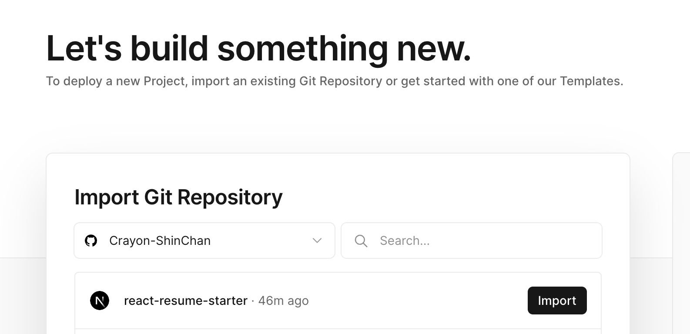

This is a resume starter/template to allow you writing your resume with React.

It has the following features:

1. ✍️ Write once, get a website & PDF!
2. 📱 Super responsive & interactive (mobile-friendly)
3. 📈 Real-time data from API call, e.g. the number of Github stars of your repo
4. 🌓 Dark/Light Mode + All the animations you desire
5. 🤖 (To be added) GPT Integration: Have AI answer queries about you!
6. ... and all the magic React offers!

## Overview


## Getting Started

fork/clone this repo

Go to the folder you cloned, run the development server:

```bash
npm install
npm run dev
```

Open [http://localhost:3000](http://localhost:3000) with your browser to see the result.

You can start editing the sections in the resume by modifying files in `components/section` folder. And change the your photo in the navbar by change the file `/components/header.tsx` and `public/images/portrait.jpeg`.

## Deploy on Vercel

VERY **EASY**! **NO CODE** NEEDED! AND **FREE**!

The easiest way to deploy this app (This is an [Next.js](https://nextjs.org) app) is to use the [Vercel Platform](https://vercel.com/new?utm_medium=default-template&filter=next.js&utm_source=create-next-app&utm_campaign=create-next-app-readme).

Go to [Vercel Platform Dashboard](https://vercel.com/dashboard), Then click `Create New -> Project`.

Then you can import your repo. (You need to fork this repo or create your own repo after cloning this repo)



Then you can deploy your app by clicking `Deploy` button.


